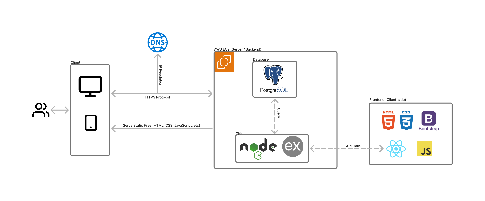

<a id="readme-top"></a>

[![Contributors][contributors-shield]][contributors-url]
[![Forks][forks-shield]][forks-url]
[![Stargazers][stars-shield]][stars-url]
[![Issues][issues-shield]][issues-url]
[![MIT License][license-shield]][license-url]
[![LinkedIn][linkedin-shield]][linkedin-url]

<!-- PROJECT LOGO -->
<br />
<div align="center">
  

  <p align="center">
    Full-Stack Food Matching Web Application
    <br />
    <a href="https://github.com/john-jaihyek-choi/finder"><strong>Explore the docs »</strong></a>
    <br />
    <br />
    <a href="https://finder.johnjhc.com">Live Demo</a>
    ·
    <a href="https://github.com/john-jaihyek-choi/finder/issues/new?labels=bug&template=bug-report---.md">Report Bug</a>
    ·
    <a href="https://github.com/john-jaihyek-choi/finder/issues/new?labels=enhancement&template=feature-request---.md">Request Feature</a>
  </p>
</div>

<!-- UPDATE -->

## Update

Since July 2024, Yelp API have switched from free model to pay-to-use model. Along with it, the amount of information it provides were also affected. Some examples include - restaurant listing photos, reviews, etc. Due to this limitation, the app now lacks features such as multiple image view for detailed restaurant view and reviews view. Starting September 2024, the API will be shut down due to a complete pay-to-use model, and therefore the restaurant search feature won't be available.

References on the background behind Yelp's sudden shift from free to pay-to-use model:

- ["After 10 Years, Yelp Gave My App 4 Days"](https://www.observationalhazard.com/2024/07/after-10-years-yelp-gave-my-app-4-days_29.html)
- [Hacker News Thread](https://news.ycombinator.com/item?id=41104597)
- ["Yelp’s lack of transparency around API charges angers developers"](https://techcrunch.com/2024/08/02/yelps-lack-of-transparency-around-api-charges-angers-developers/)

<br />

<!-- TABLE OF CONTENTS -->
<details>
  <summary>Table of Contents</summary>
  <ol>
    <li>
      <a href="#preview">Preview</a>
    </li>
    <li>
      <a href="#about-the-project">About The Project</a>
    </li>
    <li>
      <a href="#features">Features</a>
    </li>
    <li>
      <a href="#architecture-diagram">Architecture Diagram</a>
    </li>
    <li>
      <a href="#getting-started">Getting Started</a>
      <ul>
        <li><a href="#prerequisites">Prerequisites</a></li>
        <li><a href="#installation">Installation</a></li>
      </ul>
    </li>
    <!-- <li><a href="#usage">Usage</a></li> -->
    <li><a href="#roadmap">Roadmap</a></li>
    <li><a href="#contributing">Contributing</a></li>
    <li><a href="#license">License</a></li>
    <li><a href="#contact">Contact</a></li>
    <!-- <li><a href="#acknowledgments">Acknowledgments</a></li> -->
  </ol>
</details>

<!-- PREVIEW -->

## Preview

<p align="center">
  
</p>

<p align="right">(<a href="#readme-top">back to top</a>)</p>

<!-- ABOUT THE PROJECT -->

## About The Project

Finder is a dynamic full-stack web application that enables users to search for restaurants based on user-specified locations. The front-end is built using stateful React components, optimized for a seamless user experience (UI/UX) and mobile responsiveness, with CSS3 and Bootstrap 4 for styling.

A key challenge was efficiently handling multiple requests to the Yelp API using Node Fetch to retrieve and store essential restaurant data. The application stores restaurant information in a database, filtering entries with SQL queries to prevent duplicates. Updates are handled with SQL UPDATE queries, ensuring the database remains current. This data is then utilized to populate the "Liked Restaurants" page when users submit entries via a Fetch POST request.

Through developing this project, I strengthened my skills in full-stack development, including handling server requests from the front-end, creating robust back-end endpoints, and gaining a deeper understanding of React’s state management and lifecycle methods.

<p align="right">(<a href="#readme-top">back to top</a>)</p>

<!-- FEATURES -->

## Features

- User can log-in with username
- User can log-in as a guest
- User can sign-up with a desired username
- User is greeted with a message containing their username
- User can view profile page to locate "search", "location", "logout" button
- User can set a search location
- User can search restaurants by keywords
- User can view stack of cards containing the restaurants results
- User can "like" or "dislike" the restaurant card to move to next card
- User can "rewind" to move back to the previous card
- User can view details of the restaurant on click
- User can view "liked" restaurants
- User can view "reviewed" restaurants
- User can write review from the list of liked restaurants

<!-- ARCHITECTURE DIAGRAM -->

## Architecture Diagram

|              | Languages / Tools / Services                                                                                                                            |
| ------------ | ------------------------------------------------------------------------------------------------------------------------------------------------------- |
| **Language** | [![JavaScript][JavaScript]][JavaScript-url] [![HTML5][HTML5]][HTML5-url] [![CSS3][CSS3]][CSS3-url]                                                      |
| **Backend**  | [![EC2][AWSEC2]][AWSEC2-url] [![Node.js][Node.js]][Node.js-url] [![Express.js][Express.js]][Express.js-url] [![PostgreSQL][PostgreSQL]][PostgreSQL-url] |
| **Frontend** | [![React][React.js]][React-url] [![Bootstrap][Bootstrap.com]][Bootstrap-url]                                                                            |



<p align="right">(<a href="#readme-top">back to top</a>)</p>

<!-- GETTING STARTED -->

## Getting Started

This is an example of how you may give instructions on setting up your project locally.
To get a local copy up and running follow these simple example steps.

### Prerequisites

Please make sure that npm is installed in your machine.

```sh
npm install npm@latest -g
```

### Installation

1. Clone the repo
   ```sh
   git clone https://github.com/john-jaihyek-choi/finder.git
   ```
2. Navigate to the cloned directory

   ```shell
   cd finder/
   ```

3. Install all dependencies

   ```shell
   npm install
   ```

4. Start PostgreSQL database server

   ```shell
   sudo service postgresql start
   ```

5. Create the database

   ```shell
   createdb finder
   ```

6. Import the schema and dummy data

   ```shell
   npm run db:import
   ```

7. Start the project

   ```shell
   npm run dev
   ```

8. Open your default web browser and navigate to http://localhost:3000/ to see the result!

<p align="right">(<a href="#readme-top">back to top</a>)</p>

<!-- USAGE EXAMPLES -->

<!-- ## Usage

Use this space to show useful examples of how a project can be used. Additional screenshots, code examples and demos work well in this space. You may also link to more resources.

_For more examples, please refer to the [Documentation](https://example.com)_

<p align="right">(<a href="#readme-top">back to top</a>)</p> -->

<!-- ROADMAP -->

<!-- ## Roadmap

- [x] Add Changelog
- [x] Add back to top links
- [ ] Add Additional Templates w/ Examples
- [ ] Add "components" document to easily copy & paste sections of the readme
- [ ] Multi-language Support
  - [ ] Chinese
  - [ ] Spanish

See the [open issues](https://github.com/othneildrew/Best-README-Template/issues) for a full list of proposed features (and known issues).

<p align="right">(<a href="#readme-top">back to top</a>)</p> -->

<!-- CONTRIBUTING -->

## Contributing

If anyone would be interested in contributing to the development/enhancement of this application, please don't hesitate to do so, any help would be **greatly appreciated**

For any suggestion or enhancement requests, please fork the repo and create a pull request, or simply open an issue with the tag "enhancement".

1. Fork the Project
2. Create your Feature Branch (`git checkout -b feature/AmazingFeature`)
3. Commit your Changes (`git commit -m 'Add some AmazingFeature'`)
4. Push to the Branch (`git push origin feature/AmazingFeature`)
5. Open a Pull Request

### Contributors:

<a href="https://github.com/john-jaihyek-choi/finder/graphs/contributors">
  
</a>

<p align="right">(<a href="#readme-top">back to top</a>)</p>

<!-- LICENSE -->

## License

Distributed under the MIT License. See `LICENSE.txt` for more information.

<p align="right">(<a href="#readme-top">back to top</a>)</p>

<!-- CONTACT -->

## Contact

John Choi - [website](https://johnjhc.com) - choi.john.jh@gmail.com

Project Link: [https://github.com/john-jaihyek-choi/finder](https://github.com/john-jaihyek-choi/finder)

<p align="right">(<a href="#readme-top">back to top</a>)</p>

<!-- ACKNOWLEDGMENTS -->

<!-- ## Acknowledgments

List of resources found helpful during development -->

<!-- <p align="right">(<a href="#readme-top">back to top</a>)</p> -->

<!-- BADGES -->

<!-- Badges available - https://shields.io/badges -->

[contributors-shield]: https://img.shields.io/github/contributors/john-jaihyek-choi/finder?style=for-the-badge
[contributors-url]: https://github.com/john-jaihyek-choi/finder/graphs/contributors
[forks-shield]: https://img.shields.io/github/forks/john-jaihyek-choi/finder?style=for-the-badge
[forks-url]: https://github.com/john-jaihyek-choi/finder/network/members
[stars-shield]: https://img.shields.io/github/stars/john-jaihyek-choi/finder?style=for-the-badge
[stars-url]: https://github.com/john-jaihyek-choi/finder/stargazers
[issues-shield]: https://img.shields.io/github/issues/john-jaihyek-choi/finder?style=for-the-badge
[issues-url]: https://github.com/john-jaihyek-choi/finderues
[license-shield]: https://img.shields.io/github/license/john-jaihyek-choi/finder?style=for-the-badge
[license-url]: https://github.com/john-jaihyek-choi/finder/master/LICENSE.txt
[linkedin-shield]: https://img.shields.io/badge/-LinkedIn-black.svg?style=for-the-badge&logo=linkedin&colorB=555
[linkedin-url]: https://linkedin.com/in/johnjaihyekchoi
[React.js]: https://img.shields.io/badge/React-20232A?style=for-the-badge&logo=react&logoColor=61DAFB
[React-url]: https://reactjs.org/
[Next.js]: https://img.shields.io/badge/next.js-000000?style=for-the-badge&logo=nextdotjs&logoColor=white
[Next.js-url]: https://nextjs.org/
[Bootstrap.com]: https://img.shields.io/badge/Bootstrap-563D7C?style=for-the-badge&logo=bootstrap&logoColor=white
[Bootstrap-url]: https://getbootstrap.com
[HTML5]: https://img.shields.io/badge/HTML5-red?style=for-the-badge&logo=html5&labelColor=%E34F26&logoColor=white
[HTML5-url]: https://html.com/html5/
[CSS3]: https://img.shields.io/badge/CSS3-white?style=for-the-badge&logo=css3&logoColor=white&labelColor=%231572B6&color=%231572B6
[CSS3-url]: https://css3.com
[Express.js]: https://img.shields.io/badge/Express.JS-white?style=for-the-badge&logo=express&logoColor=white&labelColor=%23000000&color=%23000000
[Express.js-url]: https://express.com
[JavaScript]: https://img.shields.io/badge/JavaScript-white?style=for-the-badge&logo=javascript&logoColor=%23F7DF1E&labelColor=black&color=black
[JavaScript-url]: https://javascript.com
[TypeScript]: https://img.shields.io/badge/TypeScript-white?style=for-the-badge&logo=typescript&logoColor=white&labelColor=balck&color=%233178C6
[TypeScript-url]: https://www.typescriptlang.org/
[Node.js]: https://img.shields.io/badge/Node.JS-white?style=for-the-badge&logo=nodedotjs&logoColor=%235FA04E&labelColor=black&color=black
[Node.js-url]: https://nodejs.org/en
[PostgreSQL]: https://img.shields.io/badge/PostgreSQL-white?style=for-the-badge&logo=postgresql&logoColor=white&labelColor=%234169E1&color=%234169E1
[PostgreSQL-url]: https://www.postgresql.org/
[AWSEC2]: https://img.shields.io/badge/AWS%20EC2-orange?style=for-the-badge&logo=amazonec2&labelColor=%FF9900&logoColor=white
[AWSEC2-url]: https://aws.amazon.com/pm/ec2/
[Vue.js]: https://img.shields.io/badge/Vue.js-35495E?style=for-the-badge&logo=vuedotjs&logoColor=4FC08D
[Vue-url]: https://vuejs.org/
[Angular.io]: https://img.shields.io/badge/Angular-DD0031?style=for-the-badge&logo=angular&logoColor=white
[Angular-url]: https://angular.io/
[Svelte.dev]: https://img.shields.io/badge/Svelte-4A4A55?style=for-the-badge&logo=svelte&logoColor=FF3E00
[Svelte-url]: https://svelte.dev/
[Laravel.com]: https://img.shields.io/badge/Laravel-FF2D20?style=for-the-badge&logo=laravel&logoColor=white
[Laravel-url]: https://laravel.com
[JQuery.com]: https://img.shields.io/badge/jQuery-0769AD?style=for-the-badge&logo=jquery&logoColor=white
[JQuery-url]: https://jquery.com
